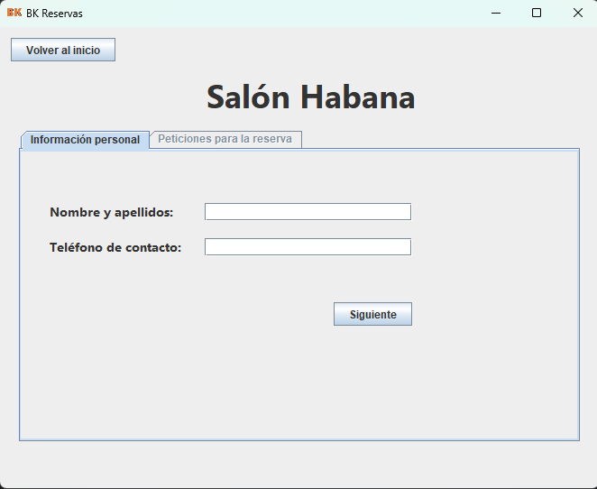
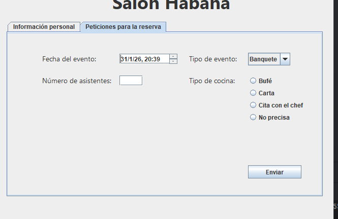
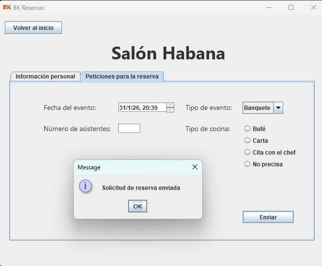
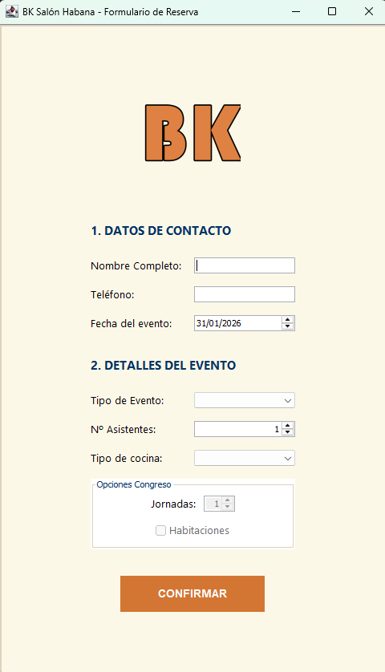
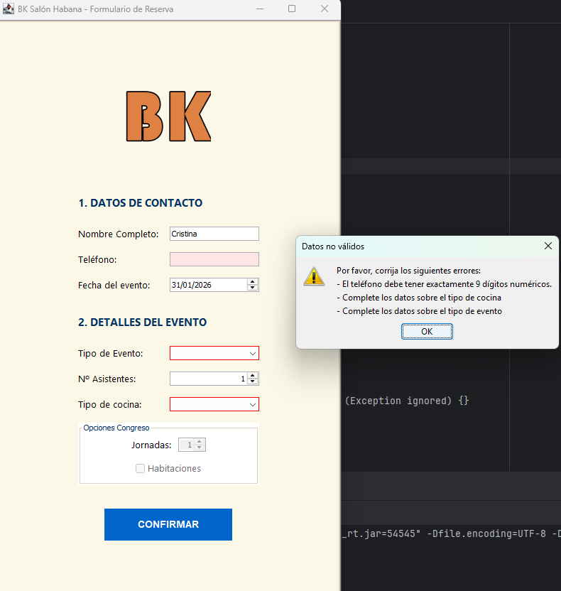
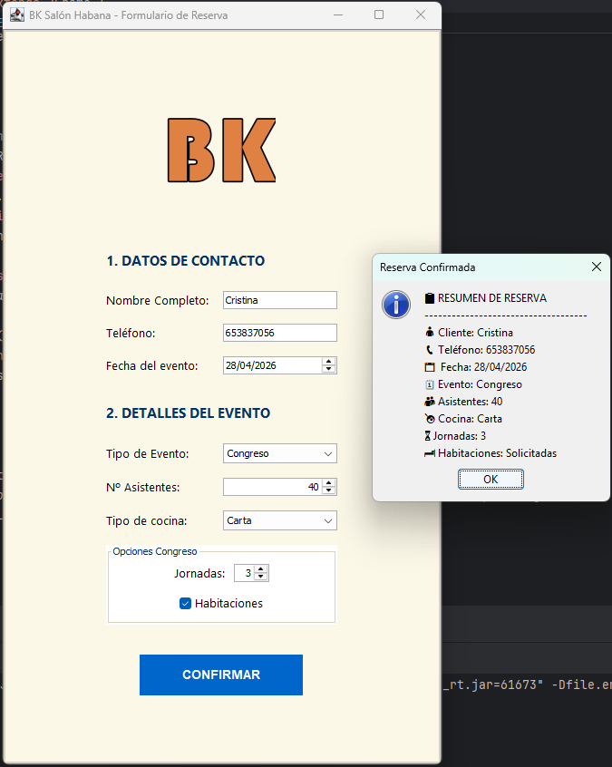

# Tarea DI04 - Desarrollo de una nueva interfaz para BK
## Introducción
La tarea consistía en mejorar la interfaz constituida en la primera tarea para adaptarla a los contenidos aprendidos 
sobre la usabilidad y estándares UX.

## Formulario inicial (Tarea 1)

El formulario inicial se hizo con Swing y con una interfaz muy simple que ofrecía un diseño desactualizado y muy 
primario. Establecí dos "pestañas" para intentar organizar el contenido.

La segunda pestaña se veía de esta manera: 

También se podían enviar datos vacíos y no existía ningun aviso ni indicacion visual para el usuario.

## Nuevo formulario (Tarea 4)
Tras realizar nuevas implementaciones, como la clase para validar la entrada de datos `ValidadorBK.java` y la clase 
`EstiloReserva.java` he aplicado colores y fuentes a la interfaz, que ahora está dividida en secciones. Se nota un 
gran cambio ahora, y además el estilo lo hecho en formulario vertical para la posible implementación en otras 
plataformas como móviles. 

Así queda la nueva interfaz:

Ahora, cuando hay algún campo con un formato incorrecto o está vacío muestra una advertencia indicando cual es el 
error, y se remarcan en color rojo para indicar al usuario qué debe modificar:

Finalmente, tras rellenar el formulario con los datos correctos un cuadro de diálogo muestra los datos de la reserva:

## Conclusiones

Simplemente con adaptar un poco el formulario, añadiendo una estructuración de contenido y mejorando la redacción se 
ve de forma mucho mas rápida y eficaz los datos a rellenar, de manera que el usuario ve de forma clara donde falta 
un dato y que es necesario para hacer la reserva. Cambiando las fuentes y dando un poco de formato de estilo con 
contrastes y colores en armonía podemos dar una apariencia mucho más profesional y trabajada.

